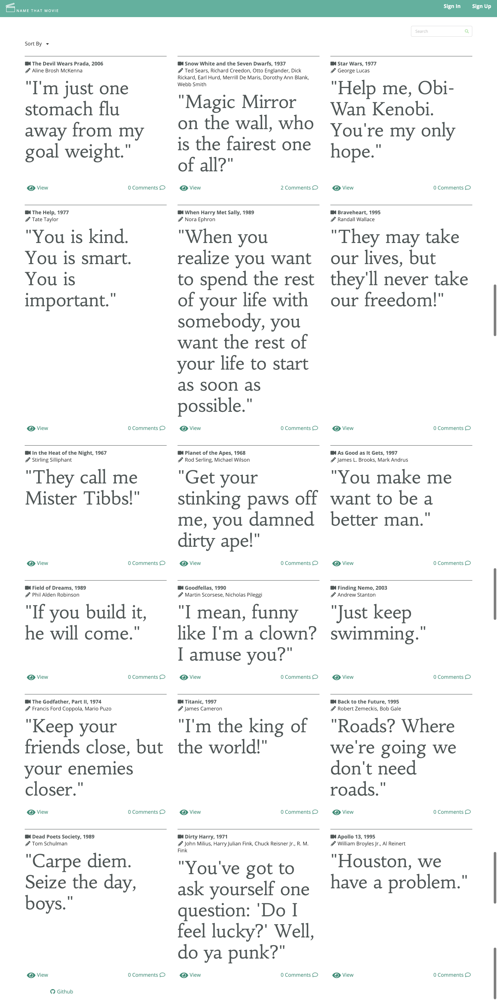

# name-that-movie
Web app to display a collection of movie quotes.
This application will display the quote, name of the movie, year movie made and the writer(s) who wrote the movie screenplay. Users can register an account to add their own favorite movie quotes and enter comments on any quote.

## Live link: coming soon

## Test site link available: send me a DM on Twitter (@runhappylife) if you would like a preview

## Screenshots

- Landing Page

- Movie Quote Collection Page

## Technology used:
- express.js 
- node.js
- javascript
- html
- pug
- css
- mongoose
- semantic-ui
- passport.js
- winston 

## Current Features:
- Quiz to test your knowledge of movie quotes
- View collection of movie quotes, user can sort by movie name movie year
- Sign up as a user to add their own favorite movie quotes
- Logged on users have ability to edit or delete movie quotes they have submitted
- Logged on users can comment on any movie quote
- Search function available to search by movie quote or movie name

## Proposed Future Features:
- Add ability for logged on users to like a movie quote
- Add ability for logged on users to favorite a movie quote
- Create user profile page for logged on users to view their own movie quotes submitted
- Create admin portal to allow admin to verify movie quotes submitted by users, delete duplicates, remove users if they violate web site use policy
- Create screenwriter profile page displayed when user clicks on a screenwriters name
- Allow logged on users to comment on a specific comment (nested comments)
- Expand search to search by movie year and screenwriter name
- Ability to add image to a movie quote